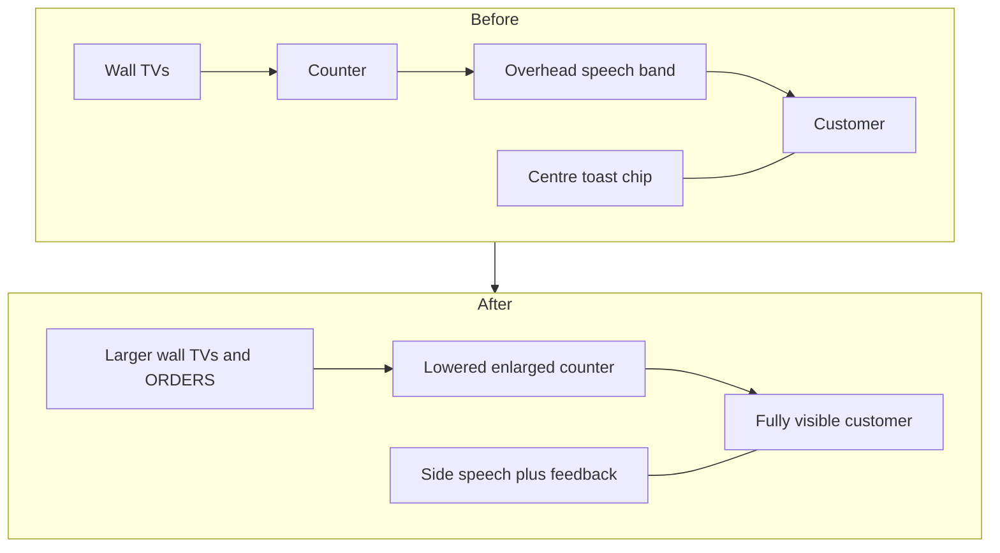

# Shop Messaging and Vertical Reflow - Plan

## Goal Capsule

- **Objective:** Remove the shop’s bottom-centre toast chip, put customer speech and customer-specific feedback beside each speaker with collision-safe placement for 1–3 customers, relocate remaining action cues onto the thing they describe, then vertically reflow the shop so everything from the counter up gains proportional space while customers stay fully visible.
- **Product authority:** Confirmed brainstorm scope for this shop-scene messaging and layout pass. Drive-mode and doorstep messaging are not active scope.
- **Open blockers:** None.

---

## Product Contract

### Summary

Kill the bottom-centre shop toast chip and give every message a clear owner: customer speech and customer-specific feedback beside the speaker, other action cues on the TV/jar/SCORE plate/ORDERS tablet they describe. Then reclaim the old overhead speech band with a measured counter drop and proportionally enlarge the counter-and-up band.

### Problem Frame

The shop stacks customer speech in a fixed band under the counter while a large bottom-centre chip competes for the same lobby strip. That wastes vertical space for what little unique information the chip still carries once a walk-in already says what they want. Prior aesthetic notes already flagged duplicated walk-in prompts. The counter was previously lowered about 5% to grow wall TVs, so another blind drop without relocating speech risks clipping customers further off-screen.

### Key Decisions

- **Remove the centre toast chip entirely** rather than keep a slim global strip. *(session-settled: user-directed — chosen over retaining bottom-centre global feedback: chip costs too much space for what it does; action cues must land elsewhere.)* Governs R1, R4.
- **Customer speech and customer-specific feedback live beside the speaker**, with collision rules for 1–3 customers. *(session-settled: user-approved — chosen over moving every toast with the customer, or keeping overhead speech: clearer ownership without mislabeling global cues.)* Governs R2, R3, R5.
- **Vertical reflow follows messaging**, not the other way around: reclaim the old overhead speech band, lower the counter modestly, keep customers fully visible, enlarge everything counter-and-up proportionally. *(session-settled: user-directed — chosen over messaging-only or TV-only growth: counter chrome and wall content should all benefit.)* Governs R6, R7, R8.
- **Pickup/delivery spawn notices use a light ORDERS home** rather than vanishing or inventing a new global banner. Governs R4.

### Requirements

**Messaging ownership**

- R1. The shop scene has no bottom-centre toast chip during key-lead / counter play.
- R2. Each walk-in customer’s speech sits beside that customer once they are settled (prefer the customer’s right; flip left when the right side collides with another customer, the screen edge, the sandwich board, or settings chrome).
- R3. Customer-specific feedback that used to appear in the toast (for example Wrong TV corrections that name a customer’s ask) appears in that customer’s side stack, not as a floating centre banner.
- R4. Remaining action cues relocate onto clear owners: Wrong TV / jar feedback near that TV or jar; Holding / Grabbing on the held item or key-lead; score deltas as a pop on the SCORE plate; pickup / delivery spawn notices as a light notice on the ORDERS tablet.
- R5. With one, two, or three customers present, no speech or customer-feedback chips overlap each other, the sandwich board, settings chrome, or counter lip, and chips do not jump every frame while a customer is still walking in.

**Vertical reflow**

- R6. After speech no longer needs the overhead band, lower the counter only enough to reclaim that band and keep each customer’s head fully visible below the counter front.
- R7. Spend recovered height proportionally across the counter-and-up band (counter chrome, TVs, ORDERS board, key-lead art / staff), not only the TV grid.
- R8. At the smallest intended 16:9 playtest size, the shop remains readable: larger counter-and-up elements, fully visible customers, and collision-safe side messaging.

### Actors

- A1. Key-lead player running the counter.
- A2. Walk-in customer(s) speaking and receiving counter service.
- A3. Shop UI surfaces that absorb former toast duties (SCORE plate, ORDERS tablet, TVs / jars, key-lead / held-item callouts).

### Key Flows

- F1. Walk-in settles and asks
  - **Trigger:** A walk-in reaches the counter and their ask becomes active.
  - **Actors:** A1, A2
  - **Steps:** Speech appears beside the customer; no centre chip restates the ask; if another customer is already present, placement flips or clamps to avoid overlap.
  - **Covered by:** R1, R2, R5
- F2. Wrong-target correction
  - **Trigger:** Player taps the wrong TV / jar for an active ask.
  - **Actors:** A1, A2, A3
  - **Steps:** Feedback appears near the wrong target and/or in the customer’s side stack naming the needed item; no centre chip.
  - **Covered by:** R3, R4
- F3. Ticket spawn while serving
  - **Trigger:** A pickup or delivery ticket spawns during counter play.
  - **Actors:** A1, A3
  - **Steps:** A light notice appears on ORDERS; the ticket remains discoverable there; no centre chip.
  - **Covered by:** R1, R4
- F4. Post-messaging vertical reflow
  - **Trigger:** Side messaging is in place and the overhead speech band is unused.
  - **Actors:** A1, A2, A3
  - **Steps:** Counter drops modestly; customers stay fully visible; counter-and-up elements enlarge proportionally; collision rules still hold.
  - **Covered by:** R6, R7, R8

### Acceptance Examples

- AE1. Single walk-in ask
  - **Covers:** R1, R2
  - **Given:** One walk-in is settled at the counter saying they want a strain.
  - **When:** The player looks at the lobby.
  - **Then:** The ask appears only beside that customer; no bottom-centre chip is visible.
- AE2. Two customers collide on the right
  - **Covers:** R2, R5
  - **Given:** Two settled customers stand close enough that both right-side bubbles would overlap.
  - **When:** Both have active speech or customer-specific feedback.
  - **Then:** At least one stack flips left or clamps so chips do not overlap each other or forbidden chrome.
- AE3. Wrong TV with no centre chip
  - **Covers:** R3, R4
  - **Given:** A walk-in wants Golden Nugget and the player taps a different TV.
  - **When:** The wrong-target feedback fires.
  - **Then:** Feedback appears near the wrong TV and/or in that customer’s side stack; the centre chip never appears.
- AE4. Score and hold without a chip
  - **Covers:** R1, R4
  - **Given:** The player earns a score delta or starts Holding / Grabbing a jar.
  - **When:** That cue would previously have used the toast.
  - **Then:** Score pops on the SCORE plate; Holding / Grabbing attaches to the held item or key-lead; no centre chip.
- AE5. Vertical reflow keeps customers readable
  - **Covers:** R6, R7, R8
  - **Given:** Messaging has moved aside and the counter has been reflowed.
  - **When:** Playtesting at the smallest intended 16:9 size with a walk-in present.
  - **Then:** The customer’s head is fully visible below the counter front, and counter-and-up elements read larger than before without clipping speech.

### Success Criteria

- Speaker ownership is obvious at a glance for 1–3 customers.
- No critical shop action cue is lost after the centre chip is removed.
- The shop reads roomier counter-and-up without clipping customers.
- Existing shop speech / counter layout regression intent still holds after coordinates change.

### Scope Boundaries

**In scope**

- Shop / key-lead messaging ownership and collision-safe side placement.
- Relocating former shop toast cues onto target owners named above.
- Measured vertical reflow of the shop counter-and-up band.

**Deferred for later**

- Drive-mode and doorstep messaging redesign.
- Full ORDERS tablet ticket-UI redesign beyond a light spawn notice home.
- Further toast-system cleanup outside shop counter play once this pass proves the chip is unused there.

**Outside this pass**

- Changing game rules, scoring math, or order spawn rates.
- Mobile shell / side-rail chrome work already shipped.

### Dependencies / Assumptions

- The shop already reserves an overhead speech band and previously lowered the counter about 5% for wider TVs; this pass reclaims that band only after speech moves aside.
- Drive and doorstep scenes may still use their own banners; this plan does not require them to share the new shop messaging pattern yet.
- A light ORDERS notice is enough for pickup / delivery spawn awareness without redesigning the whole tablet.

### Outstanding Questions

**Deferred to Planning**

- Exact counter drop and per-element scale amounts that satisfy R6–R8 without new clipping.
- Concrete collision priority when three customers all need side stacks at once.
- Visual treatment of the ORDERS light notice (duration, stacking, dismissal).

### Sources / Research

- Current shop vertical constants and speech band in `src/maps/shopT0.ts`.
- Speech placement / width / show gates in `src/scenes/ShopScene.ts` and `src/scenes/shopSpeech.test.ts`.
- Bottom toast placement and ask-echo suppression in `src/scenes/HudScene.ts`.
- Prior duplication note in `docs/audit-aesthetics-gameplay.md` (prefer one of bottom toast or floor counter prompt).
- Typography / bubble clamp notes in `docs/qa-typography.md`.
