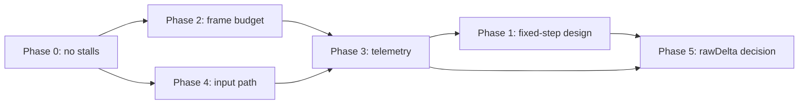

# Kindling responsive + smooth product plan (2026-09-10)

**Goal:** the installed phone PWA feels **responsive and smooth end-to-end** — taps acknowledge immediately, motion stays consistent, and there are no mid-session stalls. Input, frame budget, and measurement come first; wall-clock sim is an optional later tool, not the headline.

**Audience:** agents and humans shipping perf/responsiveness work without re-opening the slow-mo / hitch regressions documented in [KNOWN_ERRORS.md](../KNOWN_ERRORS.md).

**Read with:** [guides/smooth-2d-runtime.md](../guides/smooth-2d-runtime.md), [plans/2026-09-10-density-first-budget.md](2026-09-10-density-first-budget.md), [PR #29](https://github.com/XylarDark/KindlingGame/pull/29) (session scale lock / click-lag root cause).

**Implementation (PR #32):** fixed-step + interpolation + feel meter + `fixedRaw` default landed in code; phone field validation (Phases 2, 3 exit gates) still open.

---

## Product rule

**Success is responsive + smooth end-to-end — not “sim clock matches wall” alone.**

- Do **not** treat rawDelta / fixed-step as a fix for “feels laggy” without overlay evidence on an installed phone PWA.
- **Ship default (PR #32):** `kindlingClock` mode **`fixedRaw`** — 60 Hz fixed sim steps fed by `game.loop.rawDelta`, render interpolation on Drive movers, `fps.smoothStep: false`.
- **Fallback:** `?clock=smooth` or `localStorage kindlingClock.mode=smooth` restores PR #30 smoothed-delta feel without rebuild.
- **Diagnose:** `?meter=1` (or `localStorage kindlingMeter=1`) — on-screen fps, p95 frame ms, fixed-step backlog, tier, resize count.

---

## Success criteria

| Criterion | How we know |
|-----------|-------------|
| **Snappy input** | Tap/hold on shop tablet, drive pad, door confirm, and HUD buttons produces visible/audio ack within the **same frame** on coarse pointer; no 100–300 ms post-click freeze. |
| **No mid-session stalls** | No `scale.resize` storm, full-scene typekit sweep, or static rebake after ordinary gameplay clicks. |
| **Stable motion feel** | Drive scroll, walk-in movement, and HUD clock advance at a **consistent** perceptual rate — not alternating slow-mo and catch-up. |
| **Honest phone frame budget** | Installed PWA on a representative phone: p95 frame time within tier budget (see Phase 2) on Drive, Shop, and Door without IDE-pane-only proof. |
| **Observable, not narrated** | Regression triage uses overlay/telemetry (Phase 3), not “felt laggy on my phone” alone. |

**Not success:** green Vitest, green `tsc`, or a capture that only proves boot — necessary but insufficient ([AGENTS.md](../../AGENTS.md) definition of done still applies to code changes).

---

## Non-goals

- Restoring `fps.smoothStep: true` as a “smoothness hack” (causes whole-sim slow-mo on phones — [KNOWN_ERRORS](../KNOWN_ERRORS.md)).
- New speculative FX systems, phone PostFX, or soft full-frame scales (0.45 / 0.32 superseded — [density-first budget](2026-09-10-density-first-budget.md)).
- ASTC/ETC texture packs or new atlas authoring in this arc.
- Feel-pack polish (camera juice, haptics, juice tweens) before stalls and input path are closed.
- Changing gameplay rules, dropoff logic, or sim outcomes — only presentation timing and perf plumbing unless a doc-only pointer is needed.

---

## Prerequisites gate checklist

Arc complete when every gate passes on an **installed** phone PWA (not IDE-pane-only):

- [x] **Phase 0** — session scale lock (PR #29); coarse `sessionTierLocked`; no mid-session resize on phone.
- [x] **Phase 1** — fixed timestep + render interpolation implemented ([`kindlingClock.ts`](../../src/sim/kindlingClock.ts), [`simInterpolator.ts`](../../src/sim/simInterpolator.ts), Drive lerp).
- [ ] **Phase 2** — phone p95 frame budget met at mid **0.85** (PostFX off) on Drive, Shop, Door on **installed** PWA.
- [x] **Phase 3 (minimum)** — feel meter (`?meter=1`): fps, Δ ms, p95-ish rolling, fixed-step backlog, tier, `resize×`. Pointer-to-ack export still **Next**.
- [x] **Phase 4 (partial)** — same-frame tap ack on drive pad / phone / ID card; dropoff gate preserved. Shop tablet audit still **Next**.
- [x] **Regression guards** — [`hudTick.test.ts`](../../src/scenes/hudTick.test.ts), [`kindlingClock.test.ts`](../../src/sim/kindlingClock.test.ts), bake boot-only tests, [`renderBudget.test.ts`](../../src/ui/renderBudget.test.ts).
- [ ] **Physical device** — at least one coarse-pointer phone session recorded with overlay data, not emulator-only.

---

## Kindling file map (quick reference)

| Concern | Primary files |
|---------|----------------|
| Fixed-step clock / modes | [`src/sim/kindlingClock.ts`](../../src/sim/kindlingClock.ts) — `advanceSimClock`, `fixedRaw` \| `smooth`, `?clock=` |
| Render interpolation | [`src/sim/simInterpolator.ts`](../../src/sim/simInterpolator.ts); Drive [`update()`](../../src/scenes/DriveScene.ts) |
| Feel meter | [`src/ui/feelMeter.ts`](../../src/ui/feelMeter.ts) — `?meter=1`; `globalThis.kindlingClock` |
| FPS / smoothStep config | [`src/main.ts`](../../src/main.ts) (`wantsSmoothStep(clockMode)`, coarse 30fps limit), [`src/config.ts`](../../src/config.ts) |
| Sim tick / input sampling | [`src/scenes/HudScene.ts`](../../src/scenes/HudScene.ts) `update()` — `readInput()` → `advanceSimClock` → `sim.tick` |
| Render budget / resize | [`src/ui/renderBudget.ts`](../../src/ui/renderBudget.ts) — tiers, `sessionTierLocked`, `getRenderResizeCount` |
| CSS ↔ buffer pointer map | [`src/shell.ts`](../../src/shell.ts) `applyCanvasDisplayScale`, [`src/ui/viewFit.ts`](../../src/ui/viewFit.ts) |
| Typekit on resize | [`src/ui/typekit.ts`](../../src/ui/typekit.ts) `installTypekit` → `refreshTypekit` on `Scale.Events.RESIZE` + `VIEWFIT_EVENT` |
| Hud relayout on resize | [`src/scenes/HudScene.ts`](../../src/scenes/HudScene.ts) `layoutHud` on `RESIZE` / `VIEWFIT_EVENT` |
| Static bakes (boot-only) | [`DriveScene.bakeStaticCityMap`](../../src/scenes/DriveScene.ts), [`ShopScene` bake](../../src/scenes/ShopScene.ts), [`DoorScene.bakeDoorFacade`](../../src/scenes/DoorScene.ts) |
| Dropoff input gate | [`src/sim/dropoffConfirm.ts`](../../src/sim/dropoffConfirm.ts), [`gameSim.ts`](../../src/sim/gameSim.ts) `dropoffConfirmHeld` |
| Boot warm (no mid-game bake) | [`BootScene.ts`](../../src/scenes/BootScene.ts), [`#loading-gate`](../../src/ui/loadingGate.ts) |

---

## Phase 0 — Stop self-inflicted stalls

**Problem:** the game can hitch **after** a click even when GPU budget is otherwise fine. PR [#29](https://github.com/XylarDark/KindlingGame/pull/29) traced the chain: sim state change → RenderBudget demotion → `game.scale.resize` → `Scale.Events.RESIZE` → **`refreshTypekit()` on every Text in every scene** → multi-frame stall; optional FX tier flips forced glow/sky rebuilds.

### Requirements

1. **Session scale lock (PR #29).** On coarse pointer, seed mid **0.85** at boot and **do not** call `applyRenderScale` / `game.scale.resize` mid-session. Desktop may still demote with hysteresis; phones stay fixed tier for the session.
   - Implement via `sessionTierLocked` (or equivalent) in [`renderBudget.ts`](../../src/ui/renderBudget.ts); `tickRenderBudget` becomes promote-only or no-op on coarse when locked.
2. **Ban resize on click.** Tier evaluation must not run synchronously inside pointer handlers. [`HudScene.ts`](../../src/scenes/HudScene.ts) must not double-apply budget (local apply + `onRenderBudgetChange` listener) on the same tier flip.
3. **Ban typekit sweep on gameplay resize.** If resize still happens (desktop demotion, rare viewport change), defer `refreshTypekit` or scope it to HUD texts whose CSS floor depends on `viewFit` — never full-scene sweep on a tier flip triggered by a 48 ms hitch.
   - Today: [`installTypekit`](../../src/ui/typekit.ts) hooks `RESIZE` → `refreshTypekit(game)` walks **all** scenes.
4. **Ban bake on click.** Static bakes are **boot-only** ([`BootScene`](../../src/scenes/BootScene.ts) warm under `#loading-gate`). Verify Drive city bake, Shop interior RTs, and Door facade RT are not invoked from `update`, pointer handlers, or scene wake paths.
5. **Remove speculative demotion triggers** that reintroduce the storm: coarse one-strike + `rawDelta ≥ 48 ms` hitch demote, `setRenderStressContext` heavy-scene bands, and `phoneFxQuality()` tier invalidation that rebuilds glow on every flip — per PR #29 postmortem.

### Exit gate

- Installed phone: ten consecutive shop taps (tablet, bags, hit the road) with **no** visible freeze and overlay shows **zero** `scale.resize` events mid-session.
- Source: no `bakeStatic*` calls outside boot/warm paths; coarse session lock covered by test or guard.

---

## Phase 1 — Fixed timestep + render interpolation (Gaffer-style) — **Done (PR #32)**

### Shipped model

1. **Fixed sim step** — `FIXED_STEP_MS = 1000/60` (~16.667 ms); sim always advances in 60 Hz steps.
2. **Accumulator** — `fixedRaw` mode adds `game.loop.rawDelta` each frame; `while (acc >= FIXED_STEP_MS)` with **max 5 steps/frame** spiral guard.
3. **Render interpolation** — `SimInterpolator` prev/current; Drive lerps vehicle, walker, camera, traffic `gameMs` at `alpha = backlog / FIXED_STEP_MS`.
4. **Input sampling** — pointer/keyboard read at frame start in Hud; applied before fixed steps in the same frame.

### Not interpolated yet

Shop/Door movers (static bakes), Drive customer doorstep sprite, pin/chip text, day/night grade cadence — snap to sim ticks.

### Exit gate

- [x] Desktop: sim tests unchanged; [`kindlingClock.test.ts`](../../src/sim/kindlingClock.test.ts), [`simInterpolator.test.ts`](../../src/sim/simInterpolator.test.ts).
- [ ] Phone: Drive scroll at 30 fps render + fixed-step sim feels good vs smoothed fallback — field A/B with `?meter=1`.

---

## Phase 2 — Honest phone frame budget

**Problem:** wall-clock sim ([`HudScene`](../../src/scenes/HudScene.ts) `game.loop.rawDelta` capped at [`MAX_SIM_STEP_MS`](../../src/scenes/HudScene.ts)) **exposed** GPU fill-rate debt ([KNOWN_ERRORS](../KNOWN_ERRORS.md) DayNight entry). Smoothness requires an honest budget per frame, not chasing 60 Hz on phones.

### Targets (coarse / installed PWA)

| Scene | Tier | p95 frame time | Notes |
|-------|------|----------------|-------|
| Shop | mid 0.85 | ≤ 33 ms (~30 fps) | PostFX **off**; two static RTs + live actors |
| Drive | mid 0.85 | ≤ 33 ms | PostFX **off**; baked city cells + movers + lite glow |
| Door | mid 0.85 | ≤ 33 ms | Facade RT + live sky/glow on dirty key |

Demotion to low **0.65** is a **session-start or boot** choice on phones once Phase 0 lock exists — not mid-click. Desktop high may use PostFX at `postFxScale: 0.5` ([`renderBudget.ts`](../../src/ui/renderBudget.ts)).

### Density-first doctrine (already landed — hold the line)

- Prefer sharp pixels + cheap FX over soft scale — mid **0.85** / low **0.65** ([density-first budget](2026-09-10-density-first-budget.md)).
- PostFX off on phone mid/low; mood via Graphics ([`dayNightPipeline.ts`](../../src/art/dayNightPipeline.ts) detach on tier).
- Static bakes + atlases ([`cityTileAtlas.ts`](../../src/art/cityTileAtlas.ts), [`peopleAtlas.ts`](../../src/art/peopleAtlas.ts)) — no per-tile city Images after bake.
- **No speculative FX systems** — no new fullscreen passes, no tier-driven glow rebuild storms ([coarse-overdraw cuts](2026-09-10-coarse-overdraw-cuts.md) landed demotion cuts; Phase 0 removes counterproductive ones).

### FPS config

- [`main.ts`](../../src/main.ts): coarse `fps.target` + `fps.limit` **30**; fine 60.
- [`config.ts`](../../src/config.ts): `autoMobilePipeline: true`; design 1920×1080 with adaptive backbuffer via `scale.resize`.

### Exit gate

- Phase 3 overlay: p95 ≤ 33 ms on all three scenes, mid tier, installed PWA, 60 s session each.

---

## Phase 3 — Measurement overlay / telemetry

**Problem:** “felt laggy” without numbers caused thrash (rawDelta ↔ smoothStep ↔ resize tiers). Replace black-box narration with **session-exportable** metrics.

### Minimum overlay (dev + optional beta flag)

| Field | Source |
|-------|--------|
| `actualFps` / p95 `rawDelta` | `game.loop` |
| Active tier / `renderScale` | `getRenderBudget()` |
| `scale.resize` count | hook in [`applyRenderScale`](../../src/ui/renderBudget.ts) |
| `refreshTypekit` duration / call count | wrap [`refreshTypekit`](../../src/ui/typekit.ts) |
| Pointer → first paint ack ms | mark on `pointerdown`, clear on next `PRE_RENDER` or dom feedback |
| Scene stress context | shop / drive / door |
| Bake invocations | assert zero after boot |

**Shipped:** [`feelMeter.ts`](../../src/ui/feelMeter.ts) — toggle `?meter=1`. Dev handles: `kindlingClock.stats()`, `kindlingRenderBudget.resizeCount()`.

**Next:** pointer-to-ack ms, typekit call count, session JSON export.

### Exit gate

- One attached JSON/log from a phone session sufficient to diagnose a reported stall without asking the user to narrate timing.

---

## Phase 4 — Input path: same-frame ack; light handlers

**Problem:** even with GPU budget fixed, heavy `pointerdown` work delays ack and queues sim work behind stalls.

### Requirements

1. **Same-frame ack** — button/chip/pad toggles set visual state (tint, scale pulse, SFX) **synchronously** in the handler before any await or scene sleep/wake.
2. **No heavy work on pointer handlers** — forbid in handlers: `scale.resize`, `refreshTypekit`, `layoutHud` full pass, static bake, city rebuild, atlas regen, settings panel rebuild.
3. **Defer sim mutations that wake scenes** — where possible, queue `shopClick` / scene transitions to start of next `HudScene.update` (still same frame if handler is sync before render).
4. **Keep dropoff gate** — [`dropoffConfirm.ts`](../../src/sim/dropoffConfirm.ts) edge-triggered confirm stays; do not bypass for “responsiveness.” [`dropoffGateAccepts`](../../src/sim/dropoffConfirm.ts) prevents double-advance; swallow queued confirms during cooldown.
5. **Pointer map** — after any budget change, [`applyCanvasDisplayScale`](../../src/shell.ts) must run so hit targets align ([KNOWN_ERRORS](../KNOWN_ERRORS.md) canvas resize entry).

### Kindling hotspots to audit

- [`HudScene.onPointerDown`](../../src/scenes/HudScene.ts) / pad / tablet routing
- Shop [`ShopScene`](../../src/scenes/ShopScene.ts) interactive tablet — dirty-guard `setText` / typekit ([comments at line ~315])
- Drive [`DriveScene`](../../src/scenes/DriveScene.ts) — dirty-guard plaque typekit (~270)
- Door [`DoorScene`](../../src/scenes/DoorScene.ts) — instruction `setText` refit only on change (~301)

### Exit gate

- Overlay: p95 pointer-to-ack < 16 ms on coarse for shop tablet tap and drive pad touch.
- QA harness [`scripts/qa-glitches.ts`](../../scripts/qa-glitches.ts) still green; dropoff gate tests unchanged.

---

## Phase 5 — RawDelta / fixedRaw ship decision

**Shipped default (PR #32):** `fixedRaw` — wall-clock accumulator + 60 Hz fixed steps + Drive interpolation. Not a bare rawDelta flip: sim never uses variable per-frame dt directly.

### Fallback flag

| Mode | Query / storage | Sim | `smoothStep` |
|------|-----------------|-----|--------------|
| **`fixedRaw`** (default) | — or `kindlingClock.mode=fixedRaw` | `advanceSimClock` + `rawDelta` | `false` |
| **`smooth`** (fallback) | `?clock=smooth` | once per frame, scene `delta` | `true` |

Per-step cap: [`MAX_SIM_STEP_MS`](../../src/scenes/HudScene.ts) (1000 ms — do not tighten to 100 ms).

### Field A/B (still open)

1. Cohort A: `?clock=smooth` (PR #30 feel).
2. Cohort B: default `fixedRaw` with meter on.
3. Compare via `?meter=1`: p95 frame ms, backlog, resize×, subjective stalls.
4. Revert default to `smooth` only if phone evidence demands it — fallback stays one flag flip either way.

### Guards

- [`hudTick.test.ts`](../../src/scenes/hudTick.test.ts) — documents `fixedRaw` default and `advanceSimClock` wiring.
- Never tick sim from scene `delta` alone in `fixedRaw` mode.
- Do not re-enable `smoothStep` as a substitute for GPU budget work.

---

## Execution order

Phases 0 + 1 + 3-minimum landed in PR #32. Remaining: Phase 2 phone budget proof, Phase 3 export extras, Phase 4 shop audit, physical-device sessions.

---

## Related plans and history

| Doc | Role |
|-----|------|
| [2026-09-10-density-first-budget.md](2026-09-10-density-first-budget.md) | Phone scale / PostFX doctrine |
| [2026-09-10-coarse-overdraw-cuts.md](2026-09-10-coarse-overdraw-cuts.md) | Overdraw demotion (Phase 0 trims harmful parts) |
| [2026-09-10-drawing-board-perf.md](2026-09-10-drawing-board-perf.md) | Prior ranked perf items (bakes landed) |
| [PR #29](https://github.com/XylarDark/KindlingGame/pull/29) | Session scale lock + click-lag root cause |
| [KNOWN_ERRORS.md](../KNOWN_ERRORS.md) | smoothed delta slow-mo, DayNight hitch, SW fetch, typekit audit |

---

## Open questions

1. **Field validation** — does `fixedRaw` beat `?clock=smooth` on Luke's phone PWA with meter evidence?
2. **Session-locked low tier** — if mid 0.85 still misses p95 on oldest supported phone, boot at low 0.65 without mid-session demotion?
3. **Overlay in production** — keep `?meter=1` dev-only or ship as beta flag on installed PWA?
